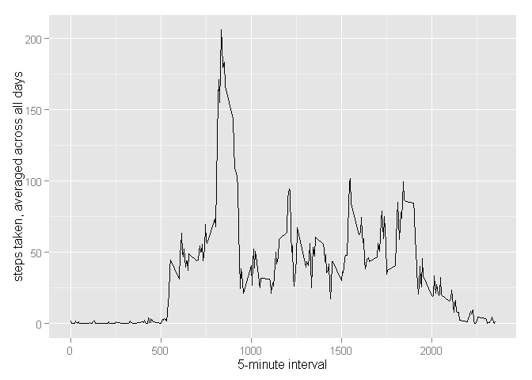

# Reproducible Research: Peer Assessment 1

## Loading and preprocessing the data

load libraries


```r
library(ggplot2)
```

```
## Warning: package 'ggplot2' was built under R version 3.2.2
```

```r
library(plyr)
```

```
## Warning: package 'plyr' was built under R version 3.2.2
```

```r
library(lattice)
```

Set the working directory to your local folder.


```r
setwd("~/GitHub/RepData_PeerAssessment1")
data = read.csv("activity.csv", header = T)
```

## What is mean total number of steps taken per day?

For this part of the assignment, you can ignore the missing values in
the dataset.

1. Make a histogram of the total number of steps taken each day


```r
data$date=as.Date(data$date)
data_reduced = aggregate(data$steps,by=list(data$date),FUN=sum, na.rm=TRUE)
hist(data_reduced$x, breaks=20, main = paste("Histogram of the total number of steps taken each day"), xlab="Steps")
```

 

2. Calculate and report the **mean** and **median** total number of steps taken per day
calculating the total number of steps taken each day

Mean:

```r
mean(data_reduced$x)
```

```
## [1] 9354.23
```

Median:

```r
median(data_reduced$x)
```

```
## [1] 10395
```

## What is the average daily activity pattern?

1. Make a time series plot (i.e. `type = "l"`) of the 5-minute interval (x-axis) and the average number of steps taken, averaged across all days (y-axis)


```r
average_steps <- aggregate(x = list(steps = data$steps), by = list(interval = data$interval), FUN = mean, na.rm = TRUE)

ggplot(data = average_steps, aes(x = interval, y = steps)) + geom_line() + xlab("5-minute interval") + 
    ylab("steps taken, averaged across all days")
```

 

2. Which 5-minute interval, on average across all the days in the dataset, contains the maximum number of steps?


```r
average_steps[which.max(average_steps$steps), ]
```

```
##     interval    steps
## 104      835 206.1698
```


## Imputing missing values

Note that there are a number of days/intervals where there are missing
values (coded as `NA`). The presence of missing days may introduce
bias into some calculations or summaries of the data.

1. Calculate and report the total number of missing values in the dataset (i.e. the total number of rows with `NA`s)


```r
sum(is.na(data$steps))
```

```
## [1] 2304
```

2. Devise a strategy for filling in all of the missing values in the dataset. The strategy does not need to be sophisticated. For example, you could use the mean/median for that day, or the mean for that 5-minute interval, etc.


```r
# replace NA with the interval average steps
average_steps = mean(average_steps$steps)
```

3. Create a new dataset that is equal to the original dataset but with the missing data filled in.


```r
# replace NA with the interval average steps
data_replaced = data
idx = which(is.na(data_replaced$steps))
data_replaced[idx,"steps"] = average_steps
```

4. Make a histogram of the total number of steps taken each day and Calculate and report the **mean** and **median** total number of steps taken per day. Do these values differ from the estimates from the first part of the assignment? What is the impact of imputing missing data on the estimates of the total daily number of steps?

### histogram of new dataset


```r
data_replaced$date=as.Date(data_replaced$date)
data_new = aggregate(data_replaced$steps,by=list(data_replaced$date),FUN=sum)
hist(data_new$x, breaks=20, main = paste("Histogram of the total number of steps taken each day"), xlab="Steps")
```

 

2. Calculate and report the **mean** and **median** total number of steps taken per day
calculating the total number of steps taken each day

Mean:

```r
mean(data_new$x)
```

```
## [1] 10766.19
```

Median:

```r
median(data_new$x)
```

```
## [1] 10766.19
```

The impact is that the mean and median both rise when the NA's are subsitiuted with average steps 


## Are there differences in activity patterns between weekdays and weekends?

For this part the weekdays() function may be of some help here. Use the dataset with the filled-in missing values for this part.

1. Create a new factor variable in the dataset with two levels -- "weekday" and "weekend" indicating whether a given date is a weekday or weekend day.


```r
data_replaced$weeksplit <- ifelse(weekdays(data_replaced$date) == "Saturday" | weekdays(data_replaced$date) == "Sunday", "Weekend", "Weekday")
data_replaced$weeksplit <- factor(data_replaced$weeksplit)
```

2. Make a panel plot containing a time series plot (i.e. type = "l") of the 5-minute interval (x-axis) and the average number of steps taken, averaged across all weekday days or weekend days (y-axis). The plot should look something like the following, which was created using simulated data:


```r
final <- ddply(data_replaced, ~interval + weeksplit, summarise, mean = mean(steps))
xyplot(mean ~ interval | weeksplit, final, type = "l", layout = c(1, 2), xlab = "Interval", ylab = "Steps")
```

 
